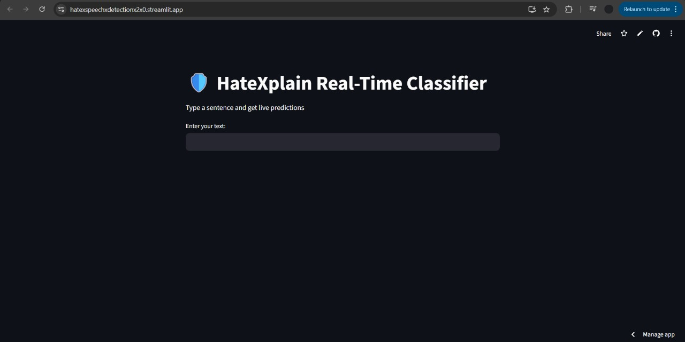
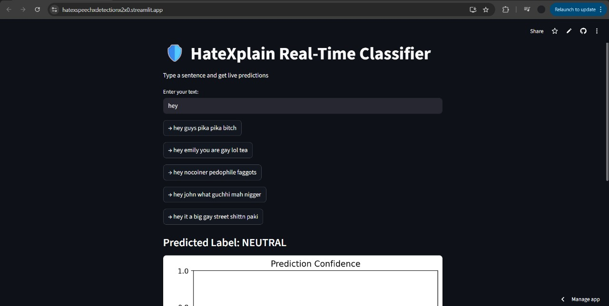
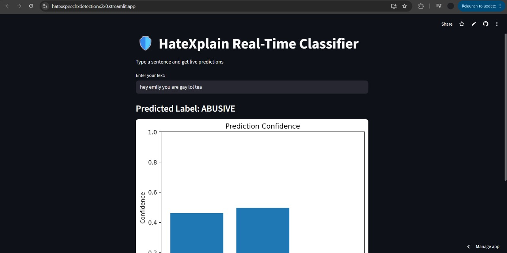
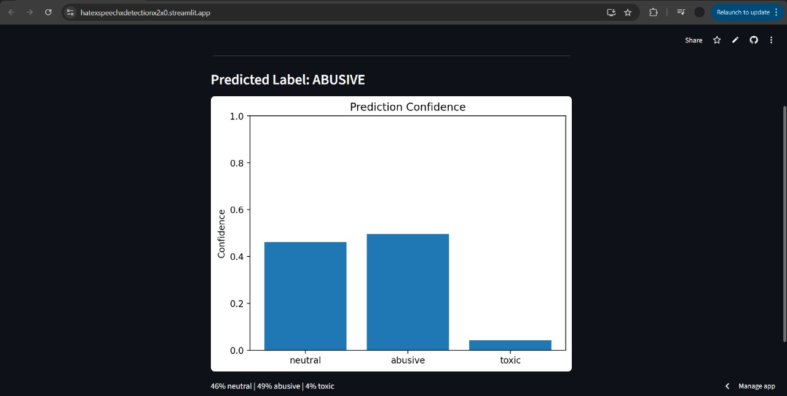
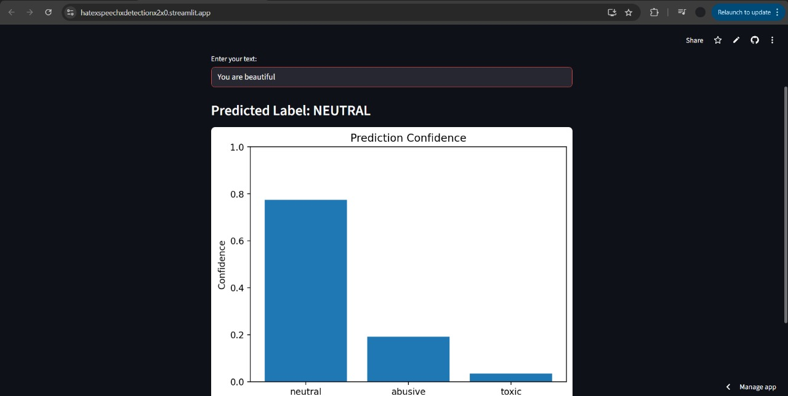

# Hate Speech Detection 2.0

A **production-ready NLP web application** for detecting and explaining hate speech using a fine-tuned Transformer model. This project demonstrates an **end-to-end ML pipeline** — from dataset handling and model training to cloud model hosting (Hugging Face) and live deployment (Streamlit).

🔗 **Live Demo**: [https://hatexspeechxdetectionx2x0.streamlit.app/](https://hatexspeechxdetectionx2x0.streamlit.app/)

---

## 🎥 Project Demo


---

## 📸 Screenshots

### 🏠 Home Page


### 💡 Text Suggestions


### 📊 Prediction Results




---

## 🚀 Project Overview

**Hate Speech Detection 2.0** is designed to classify user-provided text into hate-related categories while providing **model interpretability** and a clean, interactive UI. The project focuses on scalability, reproducibility, and real-world deployment constraints (large model size, cloud storage, inference latency).

This project is suitable for:

* NLP / ML Engineers
* Data Scientists
* Researchers working on toxic language, moderation, or social media analysis

---

## 🧠 Key Features

* ✅ Transformer-based hate speech classification (BERT-family model)
* ✅ Model hosted on **Hugging Face Hub** to handle large file sizes
* ✅ Live inference using **Streamlit**
* ✅ GPU/CPU auto-detection
* ✅ Session-based input history
* ✅ Confidence visualization
* ✅ Modular and extensible codebase
* ✅ Production-friendly deployment setup

---

## 🏗️ Architecture

```
User Input (Streamlit UI)
        ↓
Tokenizer (Hugging Face)
        ↓
Fine-tuned Transformer Model
        ↓
Softmax Probabilities
        ↓
Prediction + Confidence Visualization
```

---

## 🤗 Model Hosting (Hugging Face)

Due to GitHub’s file size limitations, the trained model is hosted on **Hugging Face Hub** and dynamically loaded during app startup.

* Model Repository: `humasfurquan/hatexplain-bert`
* Framework: PyTorch + Transformers

This approach ensures:

* Faster repository cloning
* Clean version control
* Industry-standard model sharing

---

## 🖥️ Tech Stack

| Layer         | Technology                |
| ------------- | ------------------------- |
| Language      | Python                    |
| ML Framework  | PyTorch                   |
| NLP           | Hugging Face Transformers |
| UI            | Streamlit                 |
| Visualization | Matplotlib                |
| Model Hosting | Hugging Face Hub          |
| Deployment    | Streamlit Cloud           |

---

## 📦 Installation (Local Setup)

```bash
# Clone repository
git clone https://github.com/HumasFurquan/Hate-Speech-Detection-2.0.git
cd Hate-Speech-Detection-2.0

# Create virtual environment (optional)
python -m venv venv
source venv/bin/activate  # Windows: venv\Scripts\activate

# Install dependencies
pip install -r requirements.txt

# Run the app
streamlit run app.py
```

---

## 📊 How It Works

1. User enters text in the Streamlit UI
2. Text is tokenized using the same tokenizer used during training
3. The Transformer model predicts class probabilities
4. The most probable label is returned
5. Confidence scores are visualized

---

## 📁 Project Structure

```
Hate-Speech-Detection-2.0/
│
├── app.py                 # Streamlit application
├── test_model.py          # Model testing script
├── requirements.txt       # Dependencies
├── all_texts.pkl          # Autocomplete / suggestion data
├── hf_cache/              # Hugging Face cache (runtime)
└── README.md              # Project documentation
```

---

## 🎯 Use Cases

* Social media moderation
* Toxic content filtering
* Research on online hate speech
* NLP model deployment demonstration

---

## 🔒 Limitations

* Model performance depends on dataset bias
* English-language focused
* Not a replacement for human moderation

---

## 📈 Future Improvements

* Multi-class hate category breakdown
* SHAP / attention-based explainability UI
* Multi-language support
* REST API (FastAPI backend)
* User feedback loop for model retraining
* Database-backed history instead of session state

---

## 👨‍💻 Author

**Humas Furquan**
ML & Frontend Developer
GitHub: [https://github.com/HumasFurquan](https://github.com/HumasFurquan)

---

## ⭐ Acknowledgements

* Hugging Face 🤗
* Streamlit
* Open-source NLP community

---

> If you find this project useful, consider giving it a ⭐ on GitHub.
